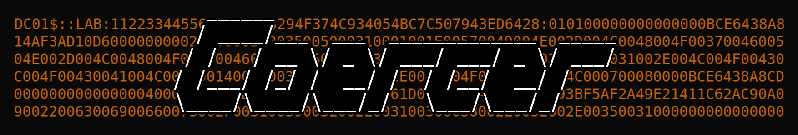
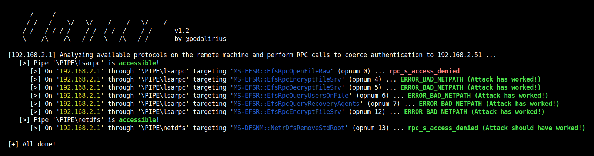

<p align="center">
  A python script to automatically coerce a Windows server to authenticate on an arbitrary machine through 8 methods.
  <br>
  
  <a href="https://twitter.com/intent/follow?screen_name=podalirius_" title="Follow"></a>
  <a href="https://www.youtube.com/c/Podalirius_?sub_confirmation=1" title="Subscribe"></a>
  <br>
</p>

## Features

 - [x] Automatically detects open SMB pipes on the remote machine.
 - [x] Calls one by one all the vulnerable RPC functions to coerce the server to authenticate on an arbitrary machine.
 - [x] Analyze mode with `--analyze`, which only lists the vulnerable protocols and functions listening, without performing a coerced authentication.

## Usage

```
       ______                              
      / ____/___  ___  _____________  _____
     / /   / __ \/ _ \/ ___/ ___/ _ \/ ___/
    / /___/ /_/ /  __/ /  / /__/  __/ /      v1.2
    \____/\____/\___/_/   \___/\___/_/       by @podalirius_

usage: coercer.py [-h] [-u USERNAME] [-p PASSWORD] [-d DOMAIN] [--hashes [LMHASH]:NTHASH] [--no-pass] [-v] [-a] [-k] [--dc-ip ip address] [-l LISTENER]
                  (-t TARGET | -f TARGETS_FILE) [--target-ip ip address]

Automatic windows authentication coercer over various RPC calls.

options:
  -h, --help            show this help message and exit
  -u USERNAME, --username USERNAME
                        Username to authenticate to the endpoint.
  -p PASSWORD, --password PASSWORD
                        Password to authenticate to the endpoint. (if omitted, it will be asked unless -no-pass is specified)
  -d DOMAIN, --domain DOMAIN
                        Windows domain name to authenticate to the endpoint.
  --hashes [LMHASH]:NTHASH
                        NT/LM hashes (LM hash can be empty)
  --no-pass             Don't ask for password (useful for -k)
  -v, --verbose
  -a, --analyze
  -k, --kerberos        Use Kerberos authentication. Grabs credentials from ccache file (KRB5CCNAME) based on target parameters. If valid credentials cannot be found, it
                        will use the ones specified in the command line
  --dc-ip ip address    IP Address of the domain controller. If omitted it will use the domain part (FQDN) specified in the target parameter
  -l LISTENER, --listener LISTENER
                        IP address or hostname of the listener machine
  -t TARGET, --target TARGET
                        IP address or hostname of the target machine
  -f TARGETS_FILE, --targets-file TARGETS_FILE
                        IP address or hostname of the target machine
  --target-ip ip address
                        IP Address of the target machine. If omitted it will use whatever was specified as target. This is useful when target is the NetBIOS name or
                        Kerberos name and you cannot resolve it
```

## Demonstration

In attack mode (without `--analyze` option) you get the following output:



And you get plenty of authentications in Responder:


## Contributing

Pull requests are welcome. Feel free to open an issue if you want to add other features.
